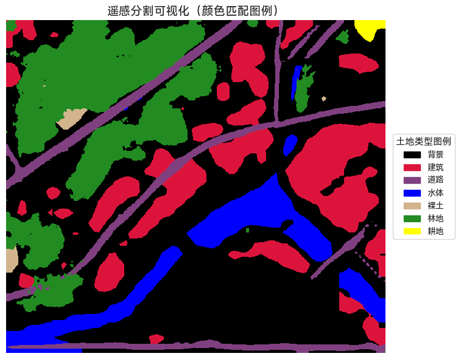

## 🌏 遥感图像分割项目（MOE 结构 | 基于 PaddleSeg 实现）

本项目基于飞桨官方图像分割套件 [PaddleSeg](https://github.com/PaddlePaddle/PaddleSeg)，面向遥感图像中的多类地物分割任务，特别引入了 **MOE（Mixture of Experts）结构**，以增强模型对复杂地形的泛化能力与精细分类能力。

---
## 🖼️ 分割效果展示

原始输入图像 
 
分割结果示例 
 

---
## 🧾 分割类别标签定义表

| 类别编号 | 类别名称（英文） | 类别名称（中文） | 说明                     |
|----------|------------------|------------------|--------------------------|
| 0        | background       | 背景             | 通常为未分类区域        |
| 1        | building         | 建筑             | 房屋、厂房等            |
| 2        | road             | 道路             | 包括主干道、辅路等      |
| 3        | water            | 水体             | 包括河流、湖泊等        |
| 4        | barren           | 裸土             | 裸露土地、沙地等        |
| 5        | forest           | 林地             | 森林、树木等            |
| 6        | agriculture      | 耕地             | 农田、种植区域          |

---

## 🛠 部署环境

本项目建议使用如下环境配置：

- Python：`3.9.20`
- PaddlePaddle-GPU：`2.5.2`
- 环境管理：推荐使用 [Anaconda](https://www.anaconda.com/) 或 [Miniconda](https://docs.conda.io/en/latest/miniconda.html)

---

## 🚀 快速开始

### 1️⃣ 克隆项目

```bash
git clone https://github.com/Republic1024/PaddleSeg3.git
cd PaddleSeg3
```

### 2️⃣ 下载模型参数（checkpoint）

请通过以下链接获取训练好的模型权重：

```
🔗 https://pan.baidu.com/s/14FohHLISAdQJCgr2NoKaoQ?pwd=rryh 
提取码: rryh
```

下载后将 `output/` 文件夹放置在项目根目录，替换原有空目录结构。

---

### 3️⃣ 创建 Python 环境（建议使用 Conda）

```bash
# 创建 Conda 虚拟环境
conda create -n ps python=3.9

# 激活环境
conda activate ps

# 安装 PaddlePaddle-GPU（根据 CUDA 版本选择）
# 以下为 CUDA 12.0 对应版本
pip install paddlepaddle-gpu==2.5.2.post120 -f https://www.paddlepaddle.org.cn/whl/windows/mkl/avx/stable.html
```

📌 请前往 [PaddlePaddle 安装页面](https://www.paddlepaddle.org.cn/install/old) 选择与你系统和显卡兼容的版本。

---

### 4️⃣ 安装项目依赖

确保当前目录含有 `requirements.txt` 文件：

```bash
pip install -r requirements.txt
```

---


## 📂 项目结构说明

项目结构模块化清晰，主要包括：

- `configs/`：模型结构与训练参数配置
- `paddleseg/`：模型实现、数据处理、损失函数等核心模块
- `tools/`：训练与推理入口脚本
- `output/`：用于保存模型与推理结果（本仓库仅保留结构）
- `*.ipynb` / `*.py`：可视化 Notebook 与实验脚本

---

## 🧠 MOE 模型任务流程说明

### ✅ 全图多类地物分割

调用自定义接口 `all_seg()` 进行整图分割，输出 0~6 类别的语义 mask：

```python
mask = all_seg(
    image_path=img_path,
    config_path="configs/segmenter/segmenter_rural2.yml",
    model_path="../output/segmenter_rural2/best_model/model.pdparams",
    save_dir="../output/test",
)
```

---

### 🌲 森林专家模块（基于 Segmenter）

引入独立森林专家模型用于提升细分类别精度：

```python
forest_mask = all_seg(
    image_path=img_path,
    config_path="./configs/segformer/segformer_udd_b3.yml",
    model_path=r"..\output\iter_40000\model.pdparams",
    save_dir="../output/test",
)
```

---

### 🔀 专家结果融合逻辑（MOE Core）

将多个专家模型的输出进行融合：

```python
mask[road_mask == 1] = 2      # 类别2：道路
mask[forest_mask == 0] = 5    # 类别5：森林
```

---

## 🔍 模型训练与预测示例

### 📌 预测（以 RtFormer 为例）

```bash
cd paddleseg
python tools/predict.py \
  --config configs/rtformer/rtformer_base_cityscapes_1024x512_120k.yml \
  --model_path ../output/rtformer_udd/best_model_2/model.pdparams \
  --image_path "../photo/DJI_00527.JPG" \
  --save_dir ../output/rtformer_udd
```

---

### 🏋️‍♂️ 训练（以 PPLiteSeg rural 为例）

```bash
python tools/train.py \
  --config configs/pp_liteseg/pp_liteseg_rural_2.yml \
  --save_dir output/rural_seg_pplite_2 \
  --save_interval 500 \
  --do_eval
```

---

## 🧪 最小示例 Demo（推荐首次运行）

进入核心模块并运行：

```bash
cd paddleseg
```

打开并运行 Jupyter 文件 `road_seg.ipynb`，完成道路类别分割测试。

---

## ⚠️ 注意事项

- `.pdparams` 权重路径必须与 `config.yml` 完全匹配
- 当前版本为“轻量代码结构”，**不含训练模型与大文件**
- 若需完整数据集与权重，请通过提取链接或自行训练

## 👤 项目作者

本项目由 [Republic1024](https://github.com/Republic1024) 维护与开发，欢迎关注与交流。

📫 联系方式：
- GitHub: [Republic1024](https://github.com/Republic1024)

## 📖 开源协议

本项目采用 [MIT License](./LICENSE) 协议开源，您可以自由使用、修改、分发该项目代码，但请保留原始版权声明。

